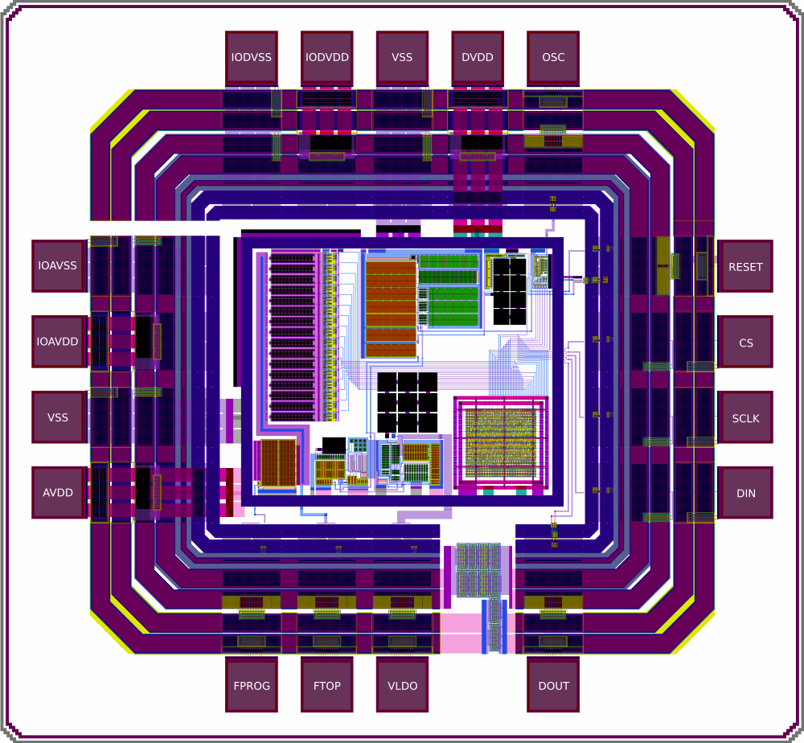
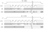

# Lumos
Lumos is an analog test chip for IHP's [SG13G2](https://github.com/IHP-GmbH/IHP-Open-PDK) technology. The chip was taped out in September 2025 and contains the following functional blocks:

- [POR](https://devstdin.github.io/asic-artefacts/ihp_por/por/)
- [Bandgap](https://devstdin.github.io/asic-artefacts/ihp_bmbg/bmbg/)
  - [OTA](https://devstdin.github.io/asic-artefacts/ihp_bmbg/bmbgota/)
- [Ref. Current Source](https://devstdin.github.io/asic-artefacts/ihp_vthref/vthref/)
- [LDO](https://devstdin.github.io/asic-artefacts/ihp_ldo/ldo/)
  - [OPAMP](https://devstdin.github.io/asic-artefacts/ihp_ldo/ldoota/)
- [6-bit Trimmable Ring Oscillator](https://devstdin.github.io/asic-artefacts/ihp_riosc/riosc/)
- [SPI Interface](#SPI-Memory-Map)
- E-Fuses

## Schematic

- [Padframe](doc/Lumos.pdf)
- [Core](doc/core.pdf)

## Layout
[GDS](https://github.com/devstdin/TO_Sep2025/tree/Lumos/Lumos/design_data/gds)

At the time the chip was laid out, there was no complete device generator for Magic in the IHP PDK. Therefore, the primitive elements in this layout were created using a custom device generator, which can be found [here](https://github.com/devstdin/IHP-Open-PDK/tree/dev/ihp-sg13g2/libs.tech/magic).

## SPI Memory Map

| SPI Address [A3:A0] | Register | Access |
| --- | --- | --- |
| 0b000 | Status | ro |
| 0b001 | Control0 | rw |
| 0b010 | Control1 | rw |
| 0b011 | Control2 | rw |

| Status0: | 7:MSB | 6 | 5 | 4 | 3 | 2 | 1 | 0:LSB |
| --- | :---: | :---: | :---: | :---: | :---: | :---: | :---: | :---: | 
|     | ctrl0[7] | ctrl0[6] | ctrl0[5] | ctrl0[4] | ctrl0[3] | ctrl0[2] | ctrl0[1] | ctrl0[0] |

| Control0: | 7:MSB | 6 | 5 | 4 | 3 | 2 | 1 | 0:LSB |
| --- | :---: | :---: | :---: | :---: | :---: | :---: | :---: | :---: | 
|     | osc en | - | trim[5] | trim[4] | trim[3] | trim[2] | trim[1] | trim[0] |

| Control1: | 7:MSB | 6 | 5 | 4 | 3 | 2 | 1 | 0:LSB |
| --- | :---: | :---: | :---: | :---: | :---: | :---: | :---: | :---: | 
|     | fuse[7] | fuse[6] | fuse[5] | fuse[4] | fuse[3] | fuse[2] | fuse[1] | fuse[0] |

| Control2: | 7:MSB | 6 | 5 | 4 | 3 | 2 | 1 | 0:LSB |
| --- | :---: | :---: | :---: | :---: | :---: | :---: | :---: | :---: | 
|     | fuse[15] | fuse[14] | fuse[13] | fuse[12] | fuse[11] | fuse[10] | fuse[9] | fuse[8] |

## SPI Transactions

